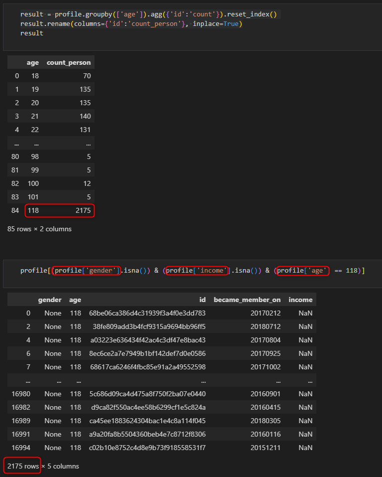
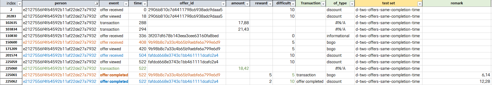
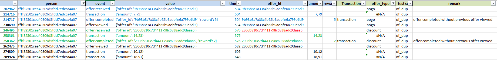
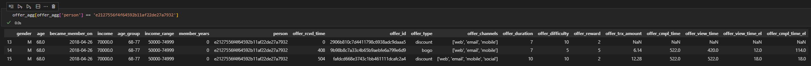

# Starbuck's Capstone Challenge - Customer Segmentation and Offer Targeting

This is a GITHUB Repository **just for educational purposes.** All data was provided by [Udacity](https://www.udacity.com/dashboard) and Starbucks.

# Table of Contents

[Project Summary](#project-summary)

[Available Data Files](#available-data-files)

[Structure of Jupyter Notebooks and Python helper module](#structure-of-jupyter-notebooks-and-python-helper-module)

[Source Data Analysis and Assessment](#source-data-analysis-and-assessment)

[Cleaning the Data and Storing Cleanded Data](#cleaning-the-data-and-storing-cleanded-data)

[Loading of Cleaned Data and Analysis](#loading-of-cleaned-data-and-analysis)>

## Project Summary

The dataset provided by starbucks simulates purchasing decisions influenced by promotional offers. Events recorded include receiving offers, viewing offers, and completing offers (making purchases with transaction amounts recorded). There are three offer types:

BOGO (Buy-One-Get-One): Spend a certain amount to get an equal reward.
Discount: Get a reward equal to a fraction of the amount spent.
Informational: No reward or spending requirement.

### Direct Marketing and Campaign Management
Direct marketing involves reaching out to customers and potential customers through various channels like email, social media, and direct mail to promote products or services using campaign management. Campaign management involves planning, executing, and monitoring marketing campaigns to achieve specific objectives. It includes coordinating various elements such as strategy development, message creation, channel selection, budget allocation, and performance tracking. Effective campaign management ensures that marketing efforts are organized, targeted, and aligned with the overall marketing goals of the business.

### Targeting
Targeting in marketing is the practice of narrowing down a target market into specific segments of consumers with common attributes and directing personalized marketing efforts toward them. This approach ensures that marketing resources are focused on the audience most likely to engage with the brand, leading to greater efficiency and return on investment.

### Conversion Rates
The conversion rate is the percentage of subjects who complete a specific desired action, such as making a purchase. Conversion rate can be calculated by taking the total number of subjects who have completed an action and dividing it by the overall size of the audience exposed to that. High conversion rates indicate effective marketing efforts.

# Problem Statement
Based on the understanding described above, my objectives in solving the Starbucks Project are:

* Offer effectiveness: Comparison of the conversion rate and the (monetary) revenue of the various BOGO and discount offers.
* Customer value: Identification of customers with the highest conversion rates and highest average revenue.
* Prediction of conversion and revenue.

In order to have insights related to conversion rates and revenue related to customers and offers the event history in transcript.json, offer.json and portfolio.json have to be analysed regarding data quality and tidiness issues have to be resolved .

**N. B. As the offers of type "informational" can hardly be related directly to purchase events, I have excluded these events from further analysis.**

# Available Data Files

The data is provided separated into three files in JSON format:

## profile.json - Customers with Starbucks reward membership
Rewards program users (17000 users x 5 fields)

* gender: (categorical) M, F, O, or null
* age: (numeric) missing value encoded as 118
* id: (string/hash)
* became_member_on: (date) format YYYYMMDD
* income: (numeric)
* portfolio.json
* Offers sent during 30-day test period (10 offers x 6 fields)

## portfolio.json - Offers description
Offers sent during 30-day test period (10 offers x 6 fields)

* reward: (numeric) money awarded for the amount spent
* channels: (list) web, email, mobile, social
* difficulty: (numeric) money required to be spent to receive reward
* duration: (numeric) time for offer to be open, in days
* offer_type: (string) bogo, discount, informational
* id: (string/hash)
* transcript.json
* Event log (306648 events x 4 fields)

## transcript.json - Interaction history including offer communication, conversion and revenue data
Event log (306648 events x 4 fields)

* person: (string/hash)
* event: (string) offer received, offer viewed, transaction, offer completed
* value: (dictionary) different values depending on event type
* offer id: (string/hash) not associated with any "transaction"
* amount: (numeric) money spent in "transaction"
* reward: (numeric) money gained from "offer completed"
* time: (numeric) hours after start of test

# Structure of Jupyter Notebooks and Python helper module
The solution consists of two Jupyter Notebooks and one Python file:

* Starbucks_Capstone_notebook.ipynb: Data quality and data tidiness analysis and cleaning; cleaned data is stored into files in Excel format
* Starbuck_Capstone_notebook-Analysis.ipynb: Data analysis and prediction model, based on data loaded from files in Excel format
* dataprocessing_helper.py: Helper function for data processing, e. g. one-hot encoding

# Source Data Analysis and Assessment

## Data Quality and Tidiness Issues
### profile.json

#### Quality Issues
In profile.json are 2175 cusotmer records with age equals to 118 years (incorrect data) and having gender None values and income NaN values (missing data). 
For gender the None values will be replaced by NaN values.

As soon as analysis/models are used which are sensitive to NaN values the data related records to these customer records will be deleted.

### transcript.json

#### Tidiness Issues

* Tidiness requirement "each observation forms a row" is not fulfilled, as each offer "history" is spread across multiple rows; some attributes are not populated in each row (e. g. amount)
* Tideness requirement "each type of observational unit forms a table" is not fulfilled, as some attributes of customer and the offer relevant for analysis are stored normalized in separated tables (profile.json, portfolio.json)
* Tideness requirement "each variable forms a column" is not fullfilled, as the column value contains a heterogenous value categories

#### Basic assumption for the relationship between offer completed events and transactions
In some cases for one customer (ids) there is more than one transaction record with the same time value as the offer completed event record are considered as one purchase event.

#### Multiple offers used per transaction
In some cases, there are multiple offers used at one transaction (assumption: same time value). This means, that the amount has to be split up. I assumed, that the amount can be split up according to the ratio of difficulty values of the offers invovled at the same time of offer completion. 

Example: Based on this assumption the amount 18,42 is split up the following way:
* offer_id 9b*: 18,42 *  5 / (5 + 10) =  6,14
* offer_id fa*: 18,42 * 10 / (5 + 10) = 12,28

#### Offer completion events without prior offer view events
In some cases, there are offer completion events without prior offer view events (e. g. offer_id 29* in the example below). Probably the there are lock screen notifications on mobile devices, which are not tracked as views. As the customer is benefiting anyhow from the the 
offer my assumption is, to accept these events as a normal completions (i. e. conversion events).

#### Transactions not related to any offer completed
**Transactions, which cannot be related to any BOGO or discount offer completed are ignored related to the subsequent anaysis of the offers success rates.**

# Cleaning the Data and Storing Cleanded Data

Preprocessing of data for basic cleaning and storing of cleaned data is done in Starbucks_Capstone_notebook.ipynb Jupyter notebook.

## Cleaning Data

Basic cleaning of data is accomplished by 
1. joining the transcript.json data with profile.json and portfolio.json data and 
2. aggregating the offer history based on customer id, offer_id, duration aggregating individual offer received and offer viewed event records into the offer received recorded and assigning transaction value as described above

Resulting table/dataframe: offer_agg

## Storing the Data

The cleaned tables/dataframes portfolio, profile, portfolio and offer_agg are stored as CSV files in order to reduce the processing effort when re-executing the analysis.

# Loading of Cleaned Data and Analysis

Loading of preprocessed data and analysis of 

* offer effectiveness: Comparison of the conversion rate and the (monetary) revenue of the various BOGO and discount offers.
* customer value: Identification of customers with the highest conversion rates and highest average revenue.
* prediction of conversion and revenue

is done in the Starbuck_Capstone_notebook-Analysis.ipynb Jupyter notebook.

# Python Version and Packages 

This project is based Python 3.12.8 and requires the following main packages:

* pandas >= 2.2.2
* matplotlib >= 3.8.4
* seaborn >= 0.13.2
* sklearn >= 1.4.2
* datetime 
